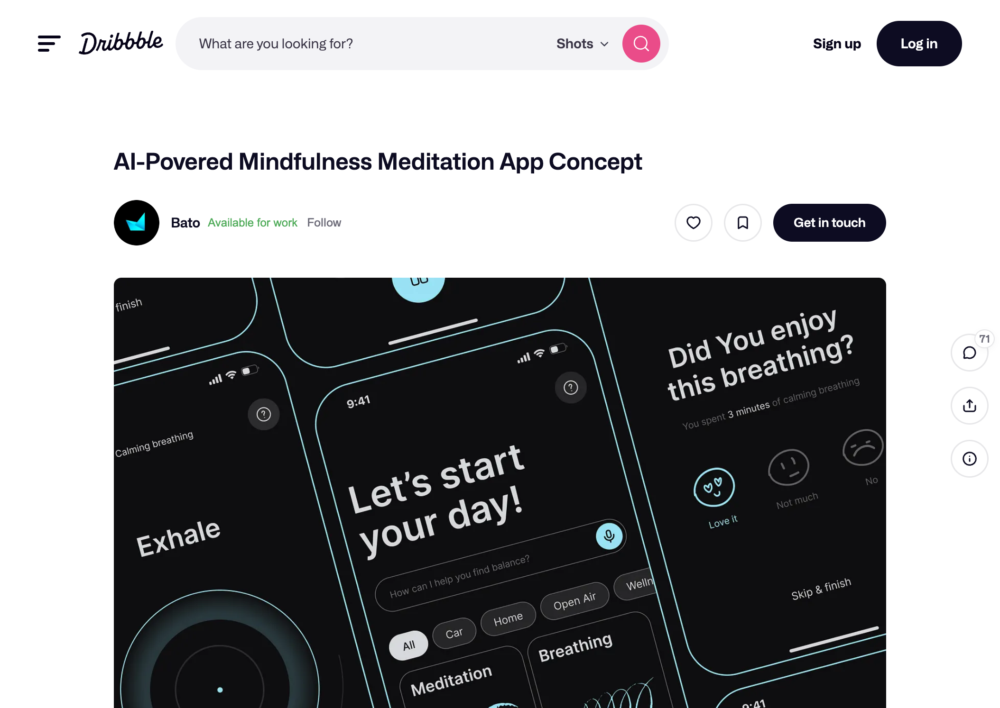
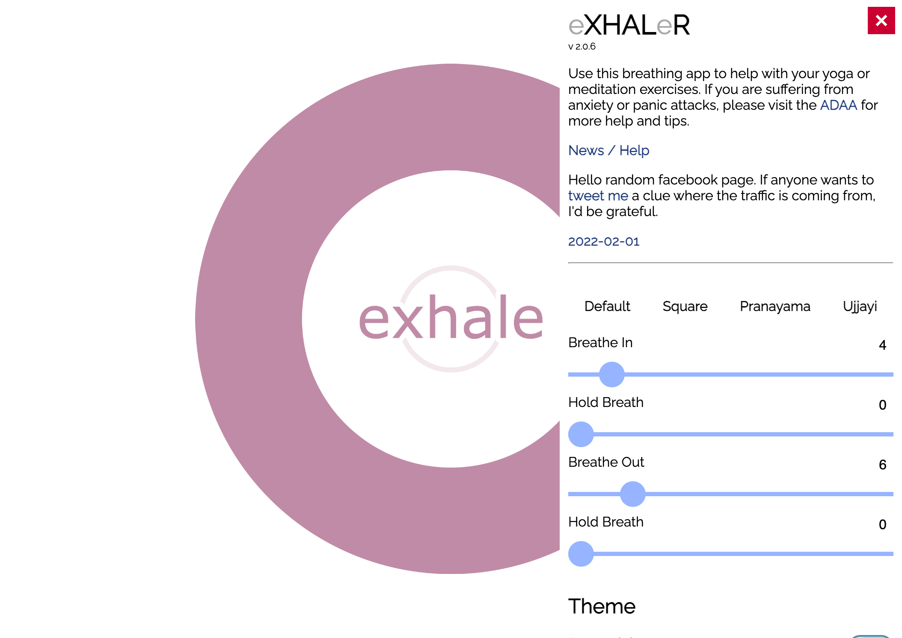
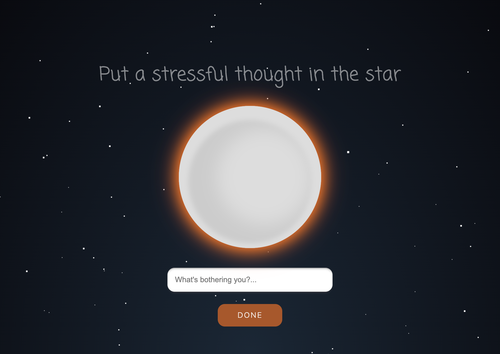
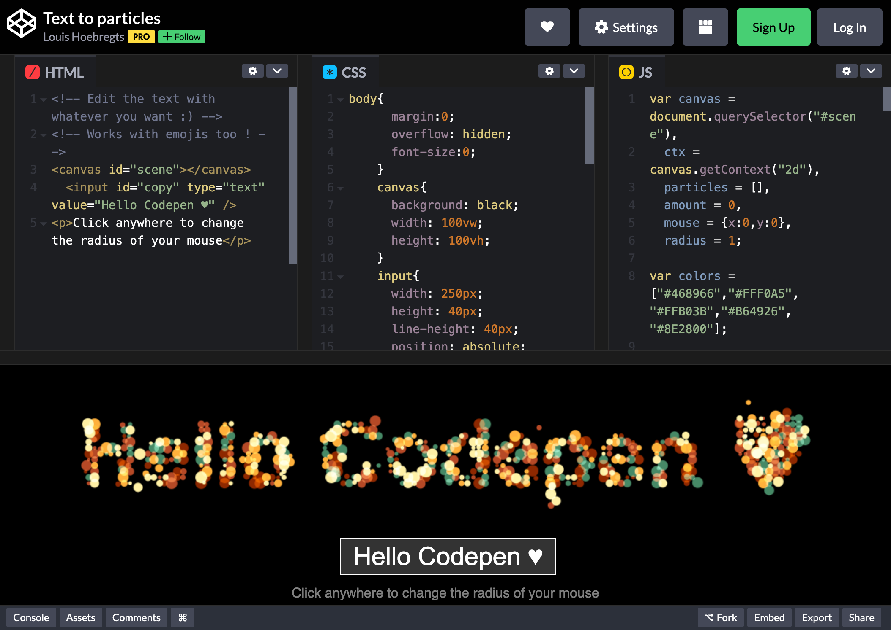

# Breathing Visualization Research

Design inspiration and reference material for the breathe-together app.

## Research Areas

| Area | Focus |
|------|-------|
| **Visual Design** | Screenshots, UI patterns, color palettes (below) |
| **[Language & Voice](./language-voice/)** | App copywriting, user language, connection concepts, phrase library |

## Screenshot Gallery

| Example | Preview |
|---------|---------|
| **Calm Breathe** |  |
| **Bato App** |  |
| **Xhalr** |  |
| **Pixel Thoughts** |  |
| **CodePen Particles** |  |

## Quick Links

| Example | Type | Key Features |
|---------|------|--------------|
| [Bato - AI Meditation App](./dribbble-bato/) | Mobile UI | Dark theme, circular timer, concentric rings |
| [Calm Breathe](./calm-breathe/) | Web App | Expanding orb, progress dot, serene gradients |
| [Xhalr](./xhalr/) | Web App | Ultra-minimal, geometric circles |
| [Pixel Thoughts](./pixel-thoughts/) | Web App | Glowing star, space theme, conceptual |
| [CodePen Particles](./codepen-particles/) | Demos | Text-to-particles, interactive backgrounds |
| [Awwwards Examples](./awwwards/) | Websites | Award-winning meditation sites |
| [Strangehelix](./dribbble-strangehelix/) | Mobile UI | Gradient phases, healthcare design |

## Design Patterns Observed

### Visual Elements
- **Circular visualizations** - Dominant pattern (rings, orbs, expanding circles)
- **Glow effects** - Warm glows add life and focus
- **Progress indicators** - Dots traveling on rings, timers, countdowns
- **Phase text** - "Inhale", "Exhale", "Hold" labels in center

### Color Palettes
- **Dark themes**: Deep blues (#1a1a2e), purples (#4a4a8a), blacks
- **Accent colors**: Teal/cyan (#4ecdc4), warm orange (#ff6b35)
- **Calming gradients**: Blue to purple transitions
- **Minimal whites**: Clean contrast against dark backgrounds

### Animation Patterns
- **Expanding/contracting circles** - Synced to breathing phases
- **Rotating progress dots** - Show time remaining
- **Pulse effects** - Subtle glow intensity changes
- **Smooth easing** - Organic, natural movement

### UX Patterns
- **Minimal UI** - Remove distractions during breathing
- **Clear phase indication** - Always show current breathing state
- **Timer visibility** - Progress through the exercise
- **Ambient backgrounds** - Nature scenes, gradients, space themes

## User Sentiment Summary (Reddit & Reviews)

### What Users Love
- **Simple, clean interfaces** that don't distract from breathing
- **Quick access** to breathing exercises (especially during panic)
- **Clear visual guidance** showing exactly when to inhale/exhale
- **Dark themes** that enhance focus and reduce eye strain
- **Conceptual depth** like Pixel Thoughts' "thought shrinking in space" metaphor

### Common Complaints
- Subscription paywalls for premium features
- Difficulty accessing breathing exercises quickly during anxiety
- Complex UIs that make it hard to follow breathing patterns
- Animations that are "too small" or unclear
- Lack of customization options

### What Sets Successful Apps Apart
| Factor | Insight |
|--------|---------|
| **Accessibility** | One-tap access to breathing exercises is critical |
| **Clarity** | Users need unambiguous phase guidance |
| **Balance** | Visual interest without distracting from breathing |
| **Personality** | Unique concepts (like Pixel Thoughts' space metaphor) resonate |
| **Feedback** | Post-session mood tracking improves engagement |

### Key Quote
> "I love the app and have been using it for years. One of my favorite tools is the breathing exercises and I often reach for a specific one when I feel a panic attack coming on."

## Recommendations for breathe-together

1. **Keep the orb central** - Circular visualization works well
2. **Add glow effects** - Creates warmth and focus
3. **Consider dark theme option** - Popular for focus/immersion
4. **Show breathing phase clearly** - Text or visual state
5. **Particle effects** - Enhance the sense of presence and life
6. **Progress indication** - Help users track their session
7. **Emphasize the "together" aspect** - Unique differentiator
8. **Ensure quick access** - Minimize clicks to start breathing
9. **Balance visual complexity** - Beautiful but not distracting
