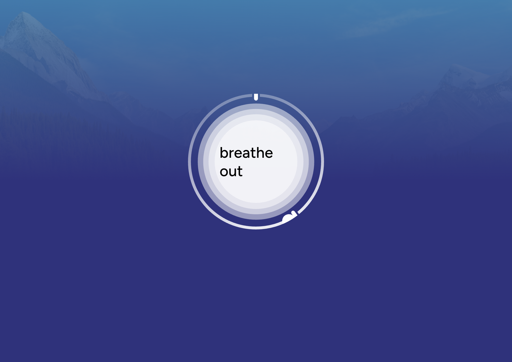

# Calm - Breathe

**Source**: [calm.com/breathe](https://www.calm.com/breathe)
**Company**: Calm (leading meditation app)
**Type**: Web-based breathing exercise

## Screenshots

*Calm's signature breathing visualization with expanding orb, progress dot, and serene gradient background*

## Overview

Calm's web breathing tool is a free, accessible breathing exercise that showcases their signature aesthetic. It's one of the most polished breathing visualizations available.

## Visual Design

### Breathing Animation
- **Central orb**: White/light colored circle that expands and contracts
- **Outer ring**: Subtle circular outline
- **Progress dot**: Small indicator traveling around the outer ring
- **Phase text**: "breathe in" / "breathe out" displayed in center

### Background
- Serene gradient from light blue to deep purple/blue
- Mountain silhouette imagery (Calm's signature aesthetic)
- Subtle atmospheric haze effect
- Creates sense of vastness and calm

### Colors
- **Background gradient**: #87ceeb (sky blue) to #2d1b69 (deep purple)
- **Orb**: White (#ffffff)
- **Ring**: Semi-transparent white
- **Text**: Dark gray on white orb

## Interaction Design

### Flow
1. Page loads directly into breathing exercise
2. Animation starts automatically
3. Continuous loop (no set duration shown)
4. Minimal UI - no controls visible during breathing

### Timing
- Smooth, slow expansion for inhale
- Gentle contraction for exhale
- Natural, organic easing curves

## Technical Notes

- Pure CSS/JS animation (no WebGL)
- Responsive design
- Mobile-friendly
- Fast loading

## Relevance to breathe-together

**Very Relevant** - Industry standard for breathing visualization:
- Proven UX pattern
- Beautiful, calming aesthetic
- Simple but effective
- Professional polish

### Ideas to Adopt
1. Progress dot around outer ring
2. Gradient background approach
3. Smooth, organic animation timing
4. Minimal UI during active breathing
5. Phase text in center of orb

## User Feedback & Public Perception

### Reddit Community Sentiment

**Positive Feedback:**
> "I love the app and have been using it for years. One of my favorite tools is the breathing exercises and I often reach for a specific one when I feel a panic attack coming on."

> "I've been using Calm every day for meditation and it's been so helpful with my anxiety... I did the 7 day course for releasing anxiety and that helped a lot."

**Criticism & Feature Requests:**
- Users note that searching for breathing exercises during a panic attack is difficult
- Requested dedicated widget for quick access to breathing exercises
- Some find the subscription model limiting for premium features

### Industry Recognition
- Named #1 App of the Year by Apple
- Top ranking in Health and Fitness category
- Over 100 million downloads and 1.5 million 5-star reviews
- Available breathing exercise options: Relax (free), Balance, Restore, Focus, Energize, Unwind

### Key Insights
- **Accessibility matters**: Quick access to breathing exercises is crucial during anxiety moments
- **Design praise**: Users frequently compliment the intuitive and attractive design
- **Content variety**: Wide range of meditations, Sleep Stories, and breathing exercises keeps experience fresh
- **Proven effectiveness**: Many users report genuine anxiety and stress reduction

### Sources
- [Calm App Reviews - Calm Blog](https://www.calm.com/blog/calm-app-reviews)
- [Healthline 2024 Calm Review](https://www.healthline.com/health/mental-health/calm-app-reviews)
