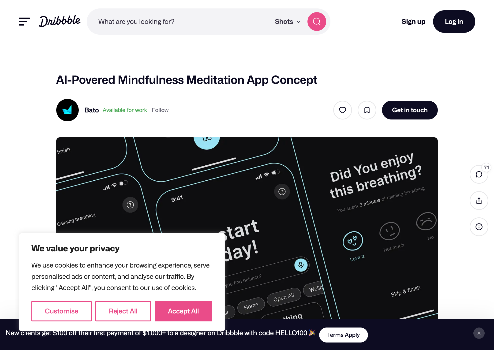

# Bato - AI-Powered Mindfulness Meditation App

**Source**: [Dribbble](https://dribbble.com/shots/25221742-AI-Povered-Mindfulness-Meditation-App-Concept)
**Designer**: Bato (batowebagency)
**Stats**: 61.5k views, 291 likes
**Type**: Mobile App Concept

## Screenshots

*Multi-screen overview showing home, breathing timer, and feedback screens*

*Clean breathing timer with concentric rings and progress indicator*

## Key Screens

### 1. Breathing Timer Screen
- Large circular breathing visualization
- Concentric rings showing progress
- Central area with "Exhale" / "Inhale" text
- Timer display: `02:15 / 3:00`
- Progress dot traveling around outer ring
- Controls: Settings, Sound, Pause button

### 2. Home Screen
- "Let's start your day!" greeting
- Category pills: All, Car, Home, Open Air, Wellness
- Section cards: Meditation (spiral icon), Breathing (wave pattern), Productivity
- Dark theme with cyan/teal accents

### 3. Feedback Screen
- "Did You enjoy this breathing?"
- Duration shown: "You spent 3 minutes of calming breathing"
- Mood selection: Love it, Not much, No (emoji-based)
- Skip & finish option

## Design Elements

### Colors
- **Background**: Deep dark blue/black (#0a0a0f)
- **Accent**: Cyan/teal (#4ecdc4, #00d9ff)
- **Text**: White, light gray
- **Cards**: Dark gray with subtle borders

### Typography
- Clean sans-serif
- Large, readable phase text
- Subtle hierarchy with size/weight

### Visual Patterns
- Concentric circles for breathing visualization
- Dot indicator for progress
- Wave patterns for breathing category icon
- Spiral for meditation icon
- Rounded corners on all elements

## Relevance to breathe-together

**Highly Relevant** - This design shows:
- How to visualize breathing phases with circular UI
- Timer and progress indication patterns
- Dark theme that enhances focus
- Clean, minimal interface during active breathing

### Ideas to Adopt
1. Concentric ring visualization
2. Progress dot traveling around circle
3. Clear phase text in center
4. Timer display format
5. Post-session feedback flow

## Design Community Reception

### Dribbble Engagement
With **61.5k views** and **291 likes**, this design concept resonated strongly with the Dribbble design community, indicating strong aesthetic appeal and relevance.

### UI/UX Best Practices Demonstrated

**From meditation app design research:**
- Dark themes enhance focus and reduce eye strain during meditation
- Concentric ring progress indicators are intuitive and calming
- Post-session feedback improves user engagement and retention

### Breathing App UI Trends (Reddit/Medium Insights)

**What users praise in breathing app designs:**
> "Clean and intuitive design... straightforward navigation and clear presentation of features"
> "The layout being easy to use is important, even for those new to meditation apps"

**Common criticisms to avoid:**
- Cluttered interfaces that distract from the breathing exercise
- Lack of clear visual progress indication
- Confusing phase transitions

### Key Patterns This Design Nails
1. **Clear visual hierarchy**: Large breathing circle dominates, controls are subtle
2. **Progress visibility**: Multiple indicators (ring, dot, timer) show progress
3. **Dark theme**: Reduces distractions, enhances focus
4. **Feedback loop**: Post-session mood check improves engagement

### Sources
- [Medium - Grow Meditation App UX Case Study](https://medium.com/@jacquestrouillet/grow-the-meditation-app-a-ui-design-case-5d0f0da5c2d3)
- [Medium - What Users Say About Meditation Apps](https://medium.com/@smart_answers/what-do-users-say-about-popular-mobile-apps-for-meditation-7dc7fdbdd699)
